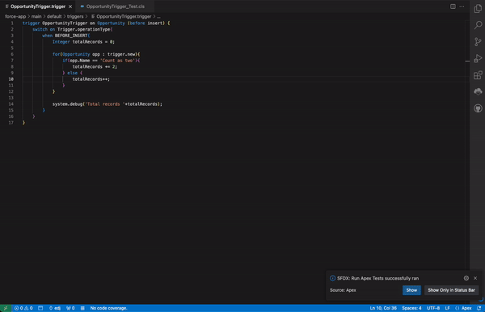

# Simple Code Coverage

This extension allows you to view the code coverage of the currently open Apex class directly within VS Code, without needing to open the Developer Console.

**Note**: This is an early version of the extension. We appreciate your patience and encourage you to contribute by submitting issues or feedback.

## Features

- **Code Coverage Display**: Shows code coverage for Apex files directly in the VS Code status bar.

## Requirements

- **SFDX CLI**: Ensure you have the Salesforce CLI (SFDX CLI) installed on your system.

## Usage

1. **Open an Apex File**: The extension will detect when an Apex file is open.
2. **View Code Coverage**: A small indicator will appear in the bottom left corner of the VS Code status bar, showing the code coverage for the open file.

## License

This project is licensed under the [MIT License](LICENSE).

Feel free to reach out if you have any questions or need assistance!
